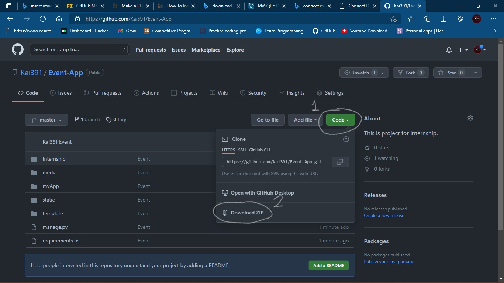
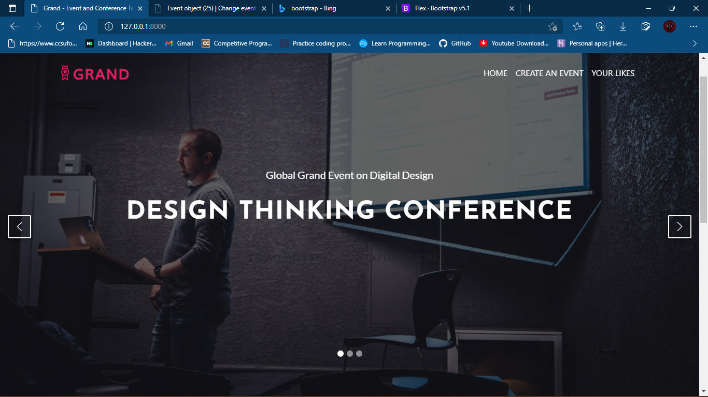
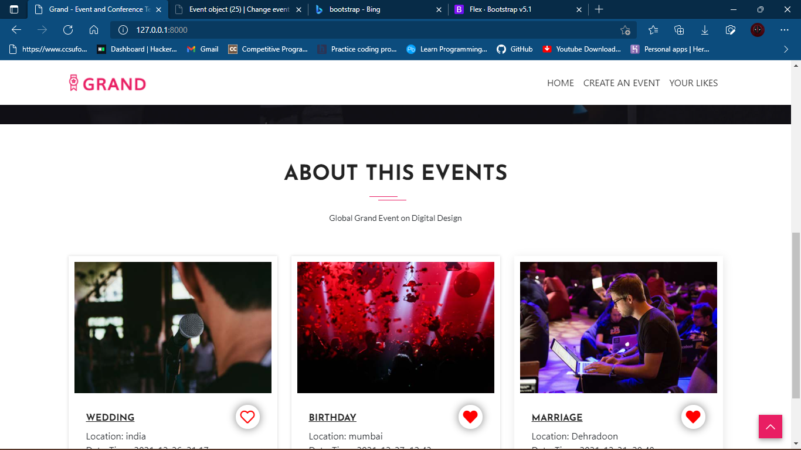
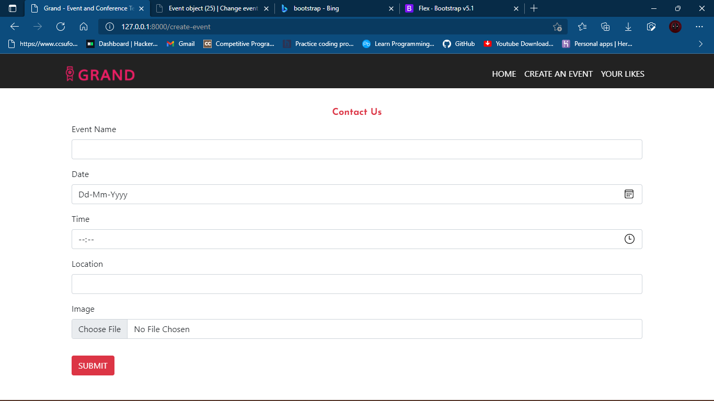

# Event App

It is Event placing application only a project base app.

## Clone or Download Application
If you already have git install
```
git clone https://github.com/Kai391/Event-App.git
```
### OR


## Installation
1.) Firstly make environment by typing command in terminal
```bash
$ pip install virtualenv
$ virtualenv env
$ cd env/Scripts/activate
```
1.) Use the package manager [pip](https://pip.pypa.io/en/stable/) to install some packages require for running it in the root folder[Inside Internship]
```bash
$ (env) cd ../../Event-App
$ (env) pip install -r requirements.txt
```
2.) Download the [MySQL Database](https://dev.mysql.com/downloads/installer/)

## Make Database and User
Open MySQL client cli running query
```bash
mysql>CREATE DATABASE Internship;
```
create user
```bash
mysql>CREATE USER 'intern'@'localhost' IDENTIFIED BY 'intern';
```
give access to user
```bash
mysql>GRANT ALL ON Internship.* TO 'intern'@'localhost';
mysql>flush privileges;
```

## Running app
In root folder where 'manage.py' file exist, run command
```bash
$ (env) python manage.py makemigrations
$ (env) python manage.py migrate
$ (env) python manage.py runserver
```
## Event Application
Boom Your application
###





## Contributing
Pull requests are welcome. For major changes, please open an issue first to discuss what you would like to change.

Please make sure to update tests as appropriate.
